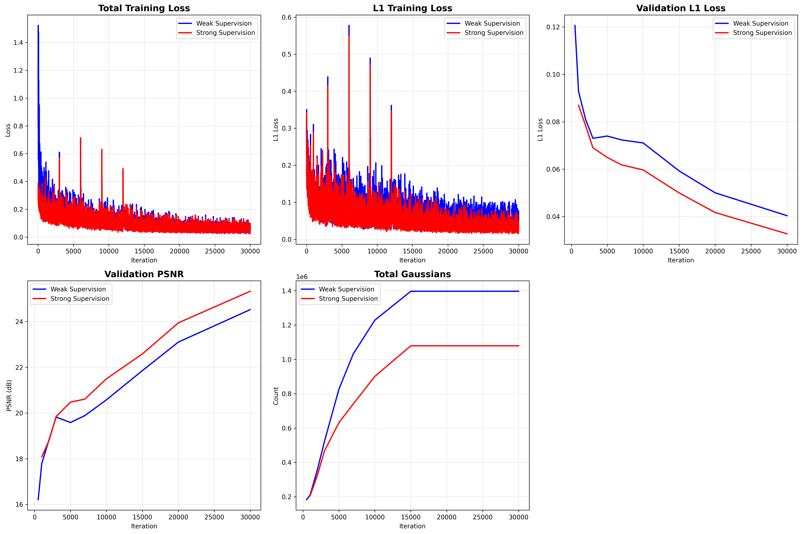

# Gaussian Splatting: Setup, Training (No-Depth / Depth / Strong-Depth), and SIBR Viewer (Headless + VNC)

Original repo cloned from https://github.com/graphdeco-inria/gaussian-splatting and then modified.

This guide walks you from a fresh Linux box to performance metrics:
- Performance & loss metrics
- Installing Miniconda + CUDA/PyTorch
- Building Gaussian Splatting submodules
- Training **without depth**, **with depth regularization**, and **with strong depth supervision**
- Building and launching **SIBR viewers** on a headless server with **Xvfb + noVNC + Cloudflare Tunnel**

---
## Loss & Performance
  Improvements (Strong supervision better):
  - ✅ L1 Loss: -45.92% improvement (0.041 vs 0.077)
  - ✅ Validation L1: -17.69% improvement
  - ✅ Validation PSNR: +3.16% improvement (25.29 vs 24.52 dB)
  - ✅ Gaussian Count: -22% fewer Gaussians (more efficient!)



---
## 0) Quick Start (Dev Tunnel)

If you’re using VS Code’s dev tunnel (or similar), you can start a simple code tunnel first:

```bash
code tunnel --accept-server-license-terms --name rented-gpu-box-1
```

If you have any activated conda environment, **deactivate** it first:

```bash
deactivate || true
```

---

## 1) Base System & Miniconda

### 1.1 Install Miniconda (Linux x86_64)
```bash
mkdir -p ~/miniconda3
wget https://repo.anaconda.com/miniconda/Miniconda3-latest-Linux-x86_64.sh -O ~/miniconda3/miniconda.sh
bash ~/miniconda3/miniconda.sh -b -u -p ~/miniconda3
rm ~/miniconda3/miniconda.sh
export PATH="/root/miniconda3/bin:$PATH"
```

### 1.2 Basic tools
```bash
apt-get update && apt-get install -y vim
```

### 1.3 Clone Gaussian Splatting
```bash
git clone https://github.com/graphdeco-inria/gaussian-splatting --recursive
cd gaussian-splatting
```

---

## 2) Conda Environment & Core Dependencies

### 2.1 Accept conda TOS (for certain channels)
```bash
conda tos accept --override-channels --channel https://repo.anaconda.com/pkgs/main
conda tos accept --override-channels --channel https://repo.anaconda.com/pkgs/r
```

### 2.2 Create & activate environment
```bash
conda create --name 3dgs -y python=3.8
source /root/miniconda3/etc/profile.d/conda.sh
conda activate 3dgs
```

### 2.3 Tooling & CUDA/PyTorch
```bash
conda install -y -c conda-forge cmake==3.27.9
pip install torch==2.1.2+cu118 torchvision==0.16.2+cu118 --extra-index-url https://download.pytorch.org/whl/cu118
conda install -c "nvidia/label/cuda-11.8.0" cuda-toolkit
pip install plyfile tqdm opencv-python joblib plyfile joblib
```

> **Note:** Duplicate package names in the example are harmless; keep as-is if you want identical behavior.

---

## 3) Build C++/CUDA Submodules

### 3.1 diff-gaussian-rasterization
```bash
conda install -y -c conda-forge libxcrypt
conda install -y -c conda-forge gcc_linux-64=11 gxx_linux-64=11

export CC="$CONDA_PREFIX/bin/x86_64-conda-linux-gnu-cc"
export CXX="$CONDA_PREFIX/bin/x86_64-conda-linux-gnu-c++"
export CUDAHOSTCXX="$CXX"

cd ~/gaussian-splatting/submodules/diff-gaussian-rasterization
pip uninstall -y diff-gaussian-rasterization || true
rm -rf build *.egg-info
pip install -vv .
```

### 3.2 fused-ssim
```bash
cd ../fused-ssim
python setup.py install
```

### 3.3 simple-knn
```bash
cd ../simple-knn/
python setup.py install
```

---

## 4) Datasets

### 4.1 Download example dataset (Tanks & Temples demo pack)
```bash
cd ~/gaussian-splatting
mkdir -p datasets && cd datasets
wget https://huggingface.co/camenduru/gaussian-splatting/resolve/main/tandt_db.zip
unzip tandt_db.zip
```

---

## 5) Training

### 5.0 Training dashboard setup
conda install -y -c conda-forge tensorboard

### 5.1 Train **without depth**
```bash
cd ~/gaussian-splatting
python train.py -s datasets/tandt/train/ -m datasets/tandt/train/training-no-depth
```

### 5.2 Train **with depth regularization** (Depth Anything V2)

#### 5.2.1 Get Depth-Anything-V2 & checkpoint
```bash
cd ~/gaussian-splatting
git clone https://github.com/DepthAnything/Depth-Anything-V2.git

mkdir -p checkpoints && cd checkpoints
wget https://huggingface.co/depth-anything/Depth-Anything-V2-Large/resolve/main/depth_anything_v2_vitl.pth
```

#### 5.2.2 Runtime libs & depth export
```bash
cd ~/gaussian-splatting
apt-get update && apt-get install -y libgl1 libglib2.0-0 libsm6 libxext6 libxrender1
pip install matplotlib

python Depth-Anything-V2/run.py \
  --encoder vitl \
  --pred-only \
  --grayscale \
  --img-path datasets/tandt/train/images \
  --outdir datasets/tandt/train/depth-images
```

#### 5.2.3 Per-image depth scale/offset & training
```bash
python utils/make_depth_scale.py --base_dir datasets/tandt/train/ --depths_dir datasets/tandt/train/depth-images

#without tensorboard
python train.py \
  -s datasets/tandt/train/ \
  -d depth-images/ \
  -m datasets/tandt/train/training-with-depth

#with tensorboard
python train.py \
    -s datasets/tandt/train/ -d depth-images \
    -m datasets/tandt/train/weak_supervision \
    --test_iterations 500 1000 2000 3000 5000 7000 10000 15000 20000 30000

#Monitor weak supervision
python monitor_training.py datasets/tandt/train/weak_supervision

```

### 5.3 Train **with strong depth supervision** (Metric Depth)

#### 5.3.1 Metric checkpoint
```bash
cd ~/gaussian-splatting/checkpoints
wget https://huggingface.co/depth-anything/Depth-Anything-V2-Metric-Hypersim-Large/resolve/main/depth_anything_v2_metric_hypersim_vitl.pth
```

#### 5.3.2 Export metric (ground-truth-like) depth
```bash
cd ~/gaussian-splatting
python Depth-Anything-V2/metric_depth/run.py \
  --encoder vitl \
  --img-path datasets/tandt/train/images \
  --outdir datasets/tandt/train/strong_gt_depth \
  --pred-only
```

#### 5.3.3 Train with strong supervision flags
```bash
python train.py \
  -s datasets/tandt/train/ \
  -m datasets/tandt/train/training-with-strong-gt-depth \
  --depth_dir datasets/tandt/train/strong_gt_depth \
  --depth_format png16 \
  --depth_units meters \
  --depth_weight 2.5 \
  --depth_loss huber \
  --depth_warmup 2000 \
  --depth_grad_weight 0.1

#with tensorboard
python train.py -s datasets/tandt/train/ \
    --depth_dir datasets/tandt/train/strong_gt_depth \
    --depth_weight 2 \
    --depth_loss huber \
    --depth_format png16 \
    --depth_units meters \
    --depth_grad_weight 0.1 \
    -m datasets/tandt/train/strong_supervision \
    --test_iterations 500 1000 2000 3000 5000 7000 10000 15000 20000 30000

#Monitor strong supervision
python monitor_training.py datasets/tandt/train/strong_supervision
```

### 5.4 Results - Training comparison
```
python compare_training.py \
  --weak datasets/tandt/train/weak_supervision \
  --strong datasets/tandt/train/strong_supervision \
  --output final_comparison
```

---

## 6) SIBR Interactive Viewers (Headless)

### 6.1 Leave conda env & enter SIBR viewers dir
```bash
deactivate || true
cd ~/gaussian-splatting/SIBR_viewers
```

### 6.2 Patches & FindASSIMP
```bash
# Replace 'embree' with 'embree3' in Raycaster CMake
sed -i.bak -E '/^[[:space:]]*target_link_libraries\(/,/^\)/ s/\<embree\>/embree3/g' \
  ~/gaussian-splatting/SIBR_viewers/src/core/raycaster/CMakeLists.txt

# Fix FindASSIMP.cmake: prefer libassimp.so and add /usr/lib/x86_64-linux-gnu
file=~/gaussian-splatting/SIBR_viewers/cmake/linux/Modules/FindASSIMP.cmake
sed -i.bak -E '/^[[:space:]]*FIND_LIBRARY\(ASSIMP_LIBRARY/,/^[[:space:]]*\)/ s/\bNAMES[[:space:]]+assimp-vc140-mt[[:space:]]+assimp\b/NAMES libassimp.so/' "$file"
sed -i -E '/^[[:space:]]*FIND_LIBRARY\(ASSIMP_LIBRARY/,/^[[:space:]]*\)/{
  /##[[:space:]]*linux/ a\
                /usr/lib/x86_64-linux-gnu
}' "$file"
```

### 6.3 FFmpeg 4.4 (Jammy) & Env wiring
```bash
export PKG_CONFIG_PATH="$CONDA_PREFIX/lib/pkgconfig${PKG_CONFIG_PATH:+:$PKG_CONFIG_PATH}"
export LD_LIBRARY_PATH="$CONDA_PREFIX/lib${LD_LIBRARY_PATH:+:$LD_LIBRARY_PATH}"

# Remove any 6.x -dev first
apt-get remove -y libavcodec-dev libavformat-dev libavutil-dev libswscale-dev libswresample-dev libavdevice-dev || true

# Add Jammy repository (22.04) for ffmpeg 4.4 only
echo 'deb http://archive.ubuntu.com/ubuntu jammy main universe' > /etc/apt/sources.list.d/jammy-ffmpeg4.list

# Pin ffmpeg to jammy
cat >/etc/apt/preferences.d/pin-ffmpeg4 <<'EOF'
Package: ffmpeg libav* libsw* libpostproc*
Pin: release n=jammy
Pin-Priority: 990
EOF

apt-get update
apt-get install -y -t jammy \
  ffmpeg \
  libavcodec-dev libavformat-dev libavutil-dev \
  libswscale-dev libswresample-dev libavdevice-dev

ffmpeg -version | head -n1            # should show 4.4.x
pkg-config --modversion libavformat   # should print 58.x
```

### 6.4 Embree3 (runtime & build discovery)
```bash
export CMAKE_PREFIX_PATH="/opt/embree3${CMAKE_PREFIX_PATH:+:$CMAKE_PREFIX_PATH}"
export PKG_CONFIG_PATH="/opt/embree3/lib/pkgconfig${PKG_CONFIG_PATH:+:$PKG_CONFIG_PATH}"
export LD_LIBRARY_PATH="/opt/embree3/lib${LD_LIBRARY_PATH:+:$LD_LIBRARY_PATH}"

cd /tmp
curl -L -o embree-3.13.5.x86_64.linux.tar.gz \
  https://github.com/embree/embree/releases/download/v3.13.5/embree-3.13.5.x86_64.linux.tar.gz
tar -xzf embree-3.13.5.x86_64.linux.tar.gz
install -d /usr/local/embree3
cp -a /tmp/embree-3.13.5.x86_64.linux/* /usr/local/embree3/
printf '/usr/local/embree3/lib\n' > /etc/ld.so.conf.d/embree3.conf
ldconfig

export PKG_CONFIG_PATH="/usr/local/embree3/lib/pkgconfig${PKG_CONFIG_PATH:+:$PKG_CONFIG_PATH}"
export CPLUS_INCLUDE_PATH="/usr/local/embree3/include${CPLUS_INCLUDE_PATH:+:$CPLUS_INCLUDE_PATH}"
export LIBRARY_PATH="/usr/local/embree3/lib${LIBRARY_PATH:+:$LIBRARY_PATH}"
export LD_LIBRARY_PATH="/usr/local/embree3/lib${LD_LIBRARY_PATH:+:$LD_LIBRARY_PATH}"
export CMAKE_PREFIX_PATH="/usr/local/embree3${CMAKE_PREFIX_PATH:+:$CMAKE_PREFIX_PATH}"
```

### 6.5 System dev packages for SIBR build
```bash
apt-get update && apt-get install -y software-properties-common
add-apt-repository -y ppa:deadsnakes/ppa
apt-get update && apt-get install -y \
  python3.8 python3.8-venv python3.8-dev build-essential curl xz-utils pkg-config yasm nasm \
  libglew-dev libassimp-dev libboost-all-dev libgtk-3-dev libopencv-dev libglfw3-dev \
  libavdevice-dev libavcodec-dev libeigen3-dev libxxf86vm-dev libembree-dev \
  libxcomposite-dev libxrandr-dev libxinerama-dev libxcursor-dev libxi-dev \
  libxrender-dev libxfixes-dev libxdamage-dev pkg-config libgtk-3-dev
```

### 6.6 Python venv for SIBR & CMake
```bash
cd ~/gaussian-splatting/SIBR_viewers
python3.8 -m venv .sibr3
source .sibr3/bin/activate
pip install cmake==3.27.9
```

### 6.7 CUDA variables (using conda CUDA 11.8)
```bash
export CUDA_HOME=/root/miniconda3/envs/3dgs
export PATH="$CUDA_HOME/bin:$PATH"
export LD_LIBRARY_PATH="$CUDA_HOME/lib64:$LD_LIBRARY_PATH"
```

### 6.8 Compiler toolchain
```bash
apt-get update && apt-get install -y gcc-11 g++-11
export CC=/usr/bin/gcc-11
export CXX=/usr/bin/g++-11
```

### 6.9 pkg-config paths (GTK/OpenGL discovery)
```bash
apt-get install -y libgtk-3-dev pkg-config
export PKG_CONFIG_PATH="/usr/lib/x86_64-linux-gnu/pkgconfig:/usr/share/pkgconfig"
export PKG_CONFIG_LIBDIR="/usr/lib/x86_64-linux-gnu/pkgconfig:/usr/share/pkgconfig"
```

### 6.10 Configure & build SIBR
```bash
cd ~/gaussian-splatting/SIBR_viewers
cmake -S . -B build \
  -DCMAKE_BUILD_TYPE=Release \
  -DPKG_CONFIG_EXECUTABLE=/usr/bin/pkg-config \
  -DCUDAToolkit_ROOT="$CUDA_HOME" \
  -DCMAKE_CUDA_COMPILER="$CUDA_HOME/bin/nvcc" \
  -DCMAKE_C_COMPILER="$CC" \
  -DCMAKE_CXX_COMPILER="$CXX" \
  -DCMAKE_CUDA_HOST_COMPILER="$CXX"

cmake --build build -j"$(nproc)"
cmake --build build -j24 --target install
```

---

## 7) Headless Viewing (VNC + noVNC + Cloudflare)

### 7.1 Install servers & Cloudflared
```bash
apt-get update && apt-get install -y x11vnc novnc websockify
curl -fsSL https://github.com/cloudflare/cloudflared/releases/latest/download/cloudflared-linux-amd64.deb -o /tmp/cloudflared.deb
dpkg -i /tmp/cloudflared.deb || apt-get -y -f install
```

### 7.2 Start X11 (Xvfb) session
```bash
# Tools
apt-get update && apt-get install -y xvfb xauth x11-utils mesa-utils

# Clean up
pkill -9 Xvfb || true
rm -f /tmp/.X11-unix/X99 /tmp/.X99-lock

# Socket dir
mkdir -p /tmp/.X11-unix && chmod 1777 /tmp/.X11-unix

# Start Xvfb
Xvfb :99 -screen 0 1280x1024x24 -ac -nolisten tcp > /tmp/Xvfb-99.log 2>&1 &

# Export display
export DISPLAY=:99.0

# Verify
pgrep -af Xvfb
# ls -l /tmp/.X11-unix/X99
# xdpyinfo | head
# glxinfo -B
```

### 7.3 Run SIBR Viewer
```bash
cd ~/gaussian-splatting/SIBR_viewers/install
./bin/SIBR_gaussianViewer_app -m ../../datasets/tandt/train/training-with-depth/
```

### 7.4 Expose via VNC + WebSockets + HTTPS
```bash
# VNC on localhost
pkill -9 x11vnc || true
x11vnc -display :99 -localhost -forever -shared -rfbport 5905 -nopw &

# noVNC on :6080
pkill -f websockify || true
websockify --web=/usr/share/novnc 6080 localhost:5905 &

# Cloudflare URL (copy final https://… link to your browser)
cloudflared tunnel \
  --protocol http2 \
  --edge-ip-version 4 \
  --url http://127.0.0.1:6080 \
  --no-autoupdate
```

Open the printed **Cloudflare URL** in your browser to control the viewer.

---

## 8) Stop Services (Cleanup)

```bash
pkill -f websockify
pkill -9 x11vnc
pkill -9 Xvfb
```

---

## Notes & Tips

- **Depth Regularization vs Strong Supervision**: Regularization uses per-image scales/offsets and encourages consistency
- **strong supervision** uses metric depth (e.g., 16‑bit PNG in meters) with explicit loss terms and weights
